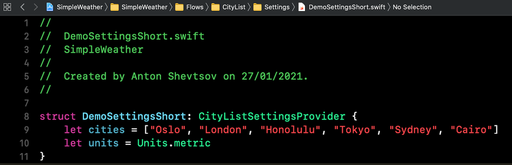
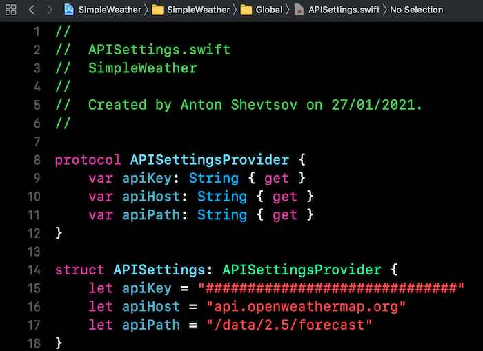

# Simple Weather

 

## Target environment
- Xcode 12.3
- Swift 5
- iOS 13+

## Project highlights
- UIKit
- MVVM
- UI designed for both iPhone and iPad
- Cell data lazy async loading
- Navigation using a bit of Combine FRP
- Logic separation
- Dependency injection
- App coordination
- Error handling
- Unit tests

## 3rd party libraries used
none

### What could be improved given more time
- better API error handling on UI side with retry and error state
- refreshing weather data over time
- more UI animations and color patterns
- more weather information on details screen
- more suitable icons for weather conditions

#### Instructions
You can edit your cities in the following file

You'll also need OpenWeatherMap API key to run this project.
Please paste your key in the APISettings.swift as on picture below.

